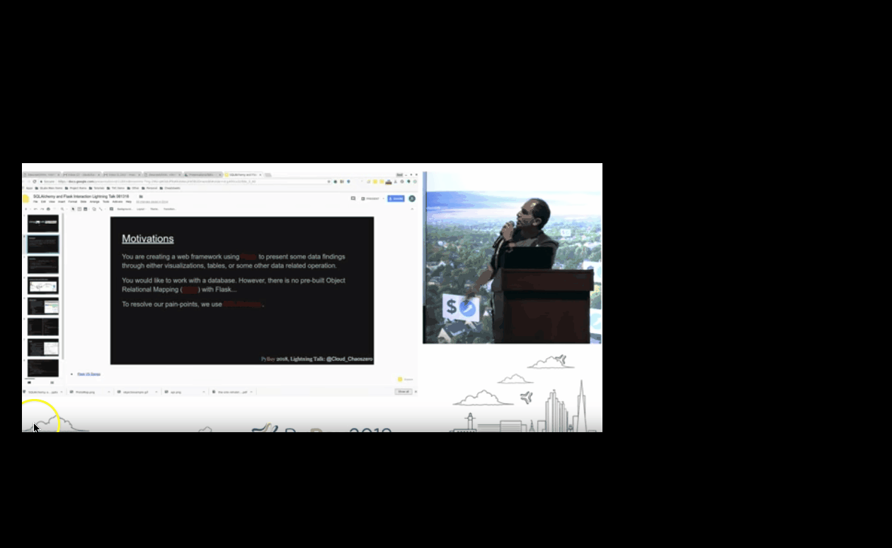

# Presentations

## Introduction

This repository is a compilation of all documents and resources for talks I have spoken at in San Francisco, Ca.

## Videos & Decks

1. Flask and SQLAlchemy Demo
	
	a. [Slide Deck](https://docs.google.com/presentation/d/118XmBmommV-THg-2MU-qW3dUP9sKKxbKeLjHK5B2Dnw/edit)
	
	b. [Video](https://youtu.be/XUsx9odu94Y?t=372)
	
2. Protos VS JSON

	a. [Slide Deck](https://github.com/CloudChaoszero/Presentations/blob/master/PyBayTalks/ProtosAndJSON/Protocol-JSON-AndMore%20(1).pptx)

3. Takes Two to Data Clean

	a. [Video](https://www.youtube.com/watch?v=OjT7mT5Ydw0&t=11s)
	
## Table of Contents

1. [Flask and SQLAlchemy Demonstration](Flask-SQLAlchemy-Demo/)

2. [Proto Buffs VS JSON structures](PyBayTalks/ProtosAndJSON/)

3. [Takes Two to Data Clean](TakesTwoToDatclean/)